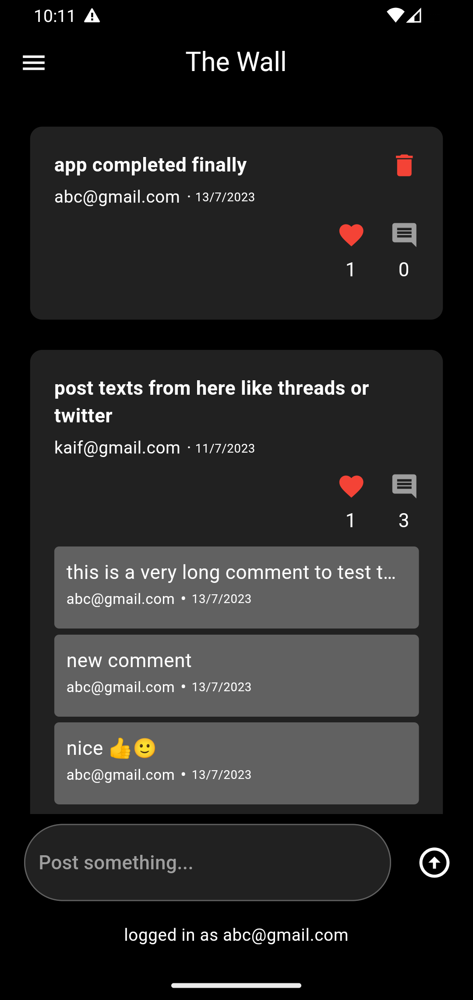

# THE WALL

Features ->

- User Login through email and password or google/github login.
- User can post some text on wall and comment on other's post.
- User can like a post.
- User can delete a post.
- supports light and dark theme based on system theme

## Screenshots

###### Login / signup pages

###### Home Page

###### Profile Page

###### Navigation Menu

###### Alert Dialogs

